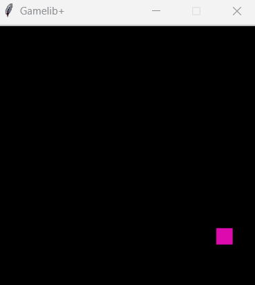
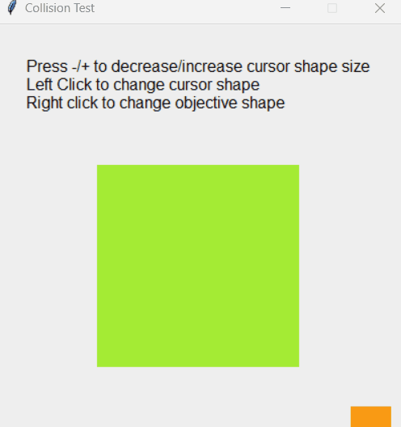

# Gamelib+

Gamelib+ is an experimental fork of the [gamelib](https://github.com/dessaya/python-gamelib) library, which is slightly more feature-rich
and with type-hinted source code, but maintaining the simplicity and
portability of the original project.

<u>*Any* project built with gamelib should work with gamelib+ too!</u>


## What's different from gamelib?

* **More prompts:** `gamelib.say` now supports an additional parameter
`msg_type`, which lets you to have multiple types of ddifferent message
boxes, like a yes/no box, a retry prompt, or a warning/error message.

* **Buttons:** Gamelib+ draws Tkinter buttons *inside* a mini-window that
the canvas contains, so it's still compatible with old projects and the
current syntax.

* *(...and more on the way)*


## Example Uses

Here is a "hello world" example:

```python
import gamelib

def main():
    gamelib.resize(300, 300)

    gamelib.draw_begin()
    gamelib.draw_text('Hello world!', 150, 150)
    gamelib.draw_end()

    # wait until the user presses any key
    gamelib.wait(gamelib.EventType.KeyPress)

gamelib.init(main)
```

And this example shows a rectangle moving around the screen:

```python
import random
import gamelib

WIDTH = 300
HEIGHT = 300
MARGIN = 5
SQ_WIDTH = 20


def _get_random_color():
    "Generates a random HEX color."
    return f"#{''.join(random.choice('0123456789abcdef') for _ in range(6))}"


def main():
    gamelib.resize(WIDTH, HEIGHT)

    sq_x, sq_y = 150, 80
    sq_color = _get_random_color()
    x1, y1, x2, y2 = ((sq_x - SQ_WIDTH / 2), (sq_y - SQ_WIDTH / 2),
                      (sq_x + SQ_WIDTH / 2), (sq_y + SQ_WIDTH / 2))
    dx, dy = 5.0, 5.0

    while gamelib.loop():
        for event in gamelib.get_events():
            if event.type == gamelib.EventType.KeyPress and event.key == 'q':
                return

        gamelib.draw_begin()
        gamelib.draw_rectangle(x1, y1, x2, y2, fill=sq_color)
        gamelib.draw_end()

        x1 += dx
        y1 += dy
        x2 += dx
        y2 += dy
        if x2 > WIDTH - MARGIN or x1 < MARGIN:
            dx *= -1
            sq_color = _get_random_color()
        if y2 > HEIGHT - MARGIN or y1 < MARGIN:
            dy *= -1
            sq_color = _get_random_color()

gamelib.init(main)
```



### Other Examples



## Goals

* **Easy to learn:** Writing a simple game should be almost as easy as writing console
  programs. It should not require knowledge about inheritance, components, double-buffering,
  color channels, blitting or actors.
* **Simple, basic API:** Support drawing stuff and maybe playing sounds, nothing more.
* **Portable** Support Windows / Mac OS / Linux desktop.
* **Easy to install:** See [relevant XKCD](https://xkcd.com/1987/). `gamelib.py` should
  not depend on anything that's not available in a fresh Python installation.
  That rules out `pip`.


## Installation

Just [download](https://raw.githubusercontent.com/nlgs2907/python-gamelib-plus/master/gamelib.py)
`gamelib.py` and place it alongside your project :)


## Documentation

First, look into the provided examples!

* [Hello world](example-01-hello-world.py)
* [Bouncing square](example-02-bounce.py)
* [Game of Life](example-03-life.py)
* [Pong](example-04-pong.py)
* [Collision](example-05-collision.py)

Gamelib+ library reference: https://nlgs2907.github.io/python-gamelib-plus/

To generate the HTML documentation:

```console
$ pip3 install pdoc3
$ bash docs/generate.sh
```

or:

```console
$ pip3 install pdoc3
$ docs/generate.bat
```


## Run the examples

```console
$ python3 example-05-collision.py
```


## Limitations

* Very limited drawing API (based on [Tkinter Canvas](https://anzeljg.github.io/rin2/book2/2405/docs/tkinter/canvas.html)).
    * Don't expect to be able to draw thousands of elements at 60 FPS.
    * The only image formats that are supported accross all platforms are GIF and PPM/PGM/PBM.
* Very limited sound API (just a single function: `play_sound()`, based on
  [playsound](https://github.com/TaylorSMarks/playsound)).
    * The only sound format supported accross all platforms is probably WAV.
* Very limited GUI API (just two functions: `say()` and `input()`).
* Supports only a single window.
* No joystick support.
